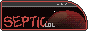
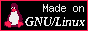
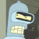
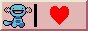
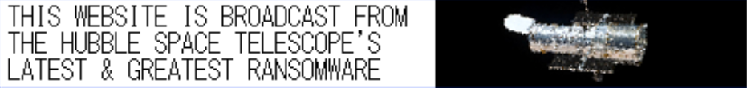

<h1>septik</h1>

מאַכט: נייל 
גיכקייַט: נייל 
וועט צו לעבן: נייל  
וואָטשט פוטוראַמאַ 41 מאל

<!--WELCOME-->

    

        
        
click for my button :3

    

    
    
    <h1 style="display: inline-block;">willkommen!</h1>
     
    welcome!! enjoy your stay here.
     
    
    

        <textarea name="" id="" cols="30" rows="10">
            
        </textarea>
    
  
    
    
hello and welcome to my slice of the cyberspace! this site is basically just an archive for all my thoughts and serves as a creative outlet, to put it simply. my main inspirations are <a href="https://arandomsite.neocities.org/">arandomsite</a>, <a href="https://sadgrl.online/">sadgrl</a>, <a href="https://jeffland.net/">jeffland</a>, <a href="https://melankorin.net/">melankorin</a>, and <a href="https://ghostingpen.neocities.org/">ghostingpen</a>. i started this site after discovering a neocities link in <a href="https://wiichicken.neocities.org/">this dude's</a> bio.

     
    best viewed with eyes

            
<!--FUTURAMA-->

    

        
        
        
        
        
    

<!--ABOUT-->

    <a href="/pages/about.html" target="Display"><h1>ÜBER MICH</h1></a> 
    information about me!
    
16 year old trekkie and futurama sleeper from NZ who is a little bit too obsessed with linguistics and languages. speaks english, german, yiddish (speaks... is an overstatement. i can understand it), and is learning latin and klingon.

    
favourite characters include zoidberg, ברוך דעם מעכטיקן זאָידבערג!, bender (obligatory), hypnotoad, bart, homer, skinner, picard, spock and data.

    

        

        

        

        

    

    
get in touch: contact@septic.lol

    

<!--CHAT-->

<h1>chatbox</h1>
    
    
    
     
    type "/auth" to chat and "/nick [NAME HERE]" to change your nickname!!
     
    <input type="text" id="message" autocomplete="off" onkeydown="handleKeyDown(event)" placeholder="chat message here" style="width: 100%; color: grey; background-color: black; border: 1px grey solid; outline: none;">
      
    

     
    use "/colour [COLOUR HERE]" to change your name colour.

<!--BUTTONS-->
<marquee onmouseover="this.stop();" onmouseout="this.start();" direction="right" behavior="alternate" class="buttons">
    
    
    
    
    
    
    
    
    
    
    
    
    
    
    
</marquee>

<!--KALENDER-->

kalender für oktober–dezember 2023

    
    <h1>Gesetzliche Feiertage, Stille Tage und Feste</h1>kalender für oktober-dezember 2023
    <table><tbody><tr><td class="vt"><table class="cht lpad"><tbody><tr><td>23. Okt</td><td>Tag der Arbeit</td></tr><tr><td>5. Nov</td><td>Guy Fawkes Nacht</td></tr></tbody></table></td><td class="chb">&nbsp;</td><td>&nbsp;</td><td class="vt"><table class="cht lpad"><tbody><tr><td>24. Dez</td><td>Heiligabend</td></tr><tr><td>25. Dez</td><td>Erster Weihnachtstag</td></tr></tbody></table></td><td class="chb">&nbsp;</td><td>&nbsp;</td><td class="vt"><table class="cht lpad"><tbody><tr><td>26. Dez</td><td>Zweiter Weihnachtstag</td></tr><tr><td>31. Dez</td><td>Silvester</td></tr></tbody></table></td></tr></tbody></table>
    
Kalender erstellt auf <a href="https://www.timeanddate.de/kalender/">www.timeanddate.de/kalender</a>

<!--BIG RINGS-->

    
    <pokering-script site="https://sep.neocities.org"></pokering-script>
    

        <link rel="stylesheet" href="https://nickolox.neocities.org/pikring/css/rock.css">
        
        
    

<!--IMG-->

    

